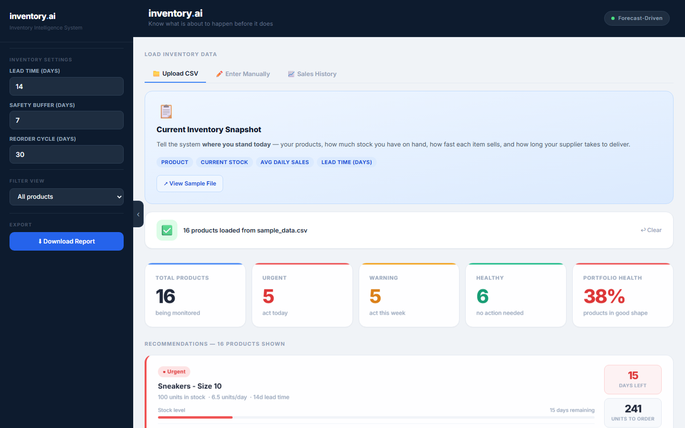
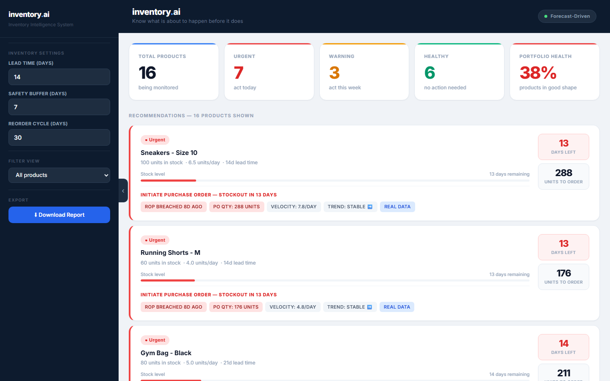
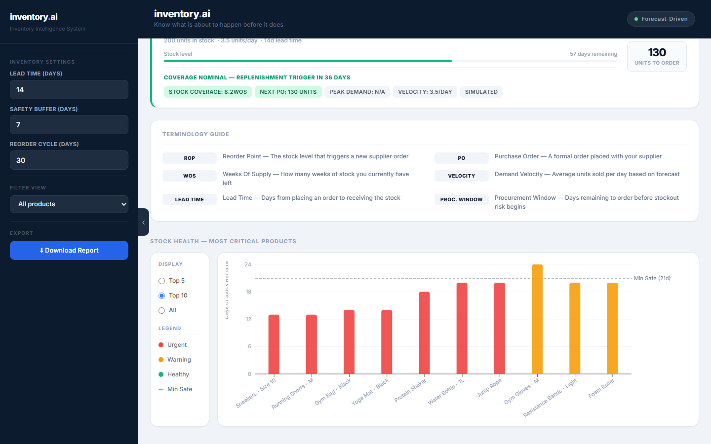

# inventory.ai — Inventory Intelligence Dashboard

**Live demo:** [inventory-forecast-ten.vercel.app](https://inventory-forecast-ten.vercel.app/)

Know what is about to happen before it does. inventory.ai analyzes your stock
levels and sales history to forecast stockouts, calculate reorder points, and
generate purchase order recommendations — the core replenishment logic used by
commercial inventory tools, built from scratch.

  
  
  

## What it does

- **Stockout forecasting** — projects days of stock remaining per product from demand velocity
- **Reorder point (ROP) detection** — flags products past their reorder point, including how many days overdue
- **Purchase order recommendations** — calculates suggested order quantities from lead time, safety buffer, and reorder cycle
- **Sales history learning** — upload daily sales data and the system derives real per-product velocities (marked REAL DATA) instead of static averages; products without history fall back to a simulated baseline
- **Portfolio health scoring** — Urgent / Warning / Healthy triage across the full catalog
- **Professional exports** — one-click Excel, Word, and PDF reports with color-coded status tables
- **Configurable parameters** — lead time, safety buffer, and reorder cycle adjustable in real time

## Try it in 30 seconds

1. Open the [live demo](https://inventory-forecast-ten.vercel.app/)
2. Click **View Sample File** to download the demo dataset, then drop it into the uploader
3. Optionally add `sample_history.csv` under the **Sales History** tab to see learned forecasts replace static averages

## Tech stack

Next.js · React · TypeScript · Tailwind CSS · Recharts · Vitest

All analysis runs client-side in the browser — no backend, no data leaves your machine.

## Supply chain concepts implemented

Reorder Point (ROP) · Weeks of Supply (WOS) · Demand velocity · Lead time · Safety stock buffers · Procurement windows

## About

Built by [Ramanuj Kumraj](https://www.linkedin.com/in/ramanuj-kumraj) — Supply
Chain Management & Finance student at the University of Toledo. This project
applies coursework inventory theory (EOQ, safety stock, ABC analysis) as
working software.

## Roadmap

- LLM-powered inventory analysis and natural-language insights
- Real time-series forecasting (seasonal decomposition)
- Saved sessions and multi-portfolio support
